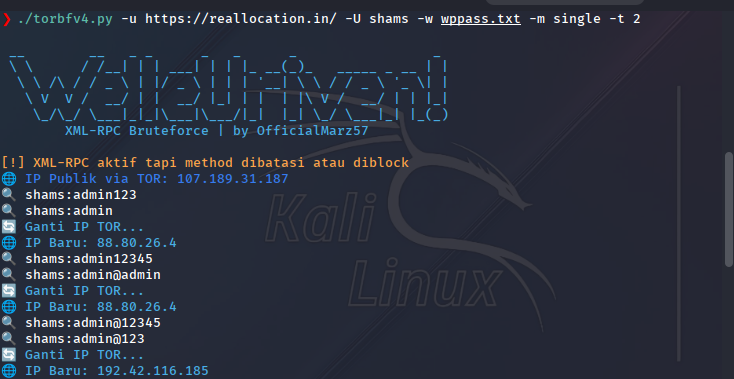

# xmlrpc-torbrute
torbfv4.py adalah tools brute-force WordPress yang menyerang endpoint xmlrpc.php dengan dua mode:

multicall → mengirim banyak permintaan sekaligus (efisien & cepat)

single → satu per satu, cocok untuk bypass WAF / rate limit
.
.
.
# 🔐 Tools ini berjalan via TOR dan bisa:

Auto-ganti IP secara otomatis

Deteksi metode XML-RPC aktif

Gunakan User-Agent acak untuk menghindari fingerprinting

Simpan login berhasil ke success.txt

Support multi-threading di mode single

CLI dengan opsi lengkap
.
.
.
# 🚀 Fitur Utama

✅ Pilih mode multicall atau single

✅ Auto switch IP via TOR (NEWNYM)

✅ Cek IP publik TOR (icanhazip.com)

✅ Delay acak antar request (bypass WAF)

✅ Random User-Agent

✅ Simpan hasil login berhasil

✅ Multi-threading untuk brute force cepat (single mode)

✅ Deteksi awal method xmlrpc
.
.
.
# 🔧 Installation
🐍 Python Dependencies

    pip install requests stem termcolor
.
.
.
# 🧅 Enable TOR + ControlPort

Install TOR:
    
    sudo apt install tor
.
.
.
Edit file TOR config 
    /etc/tor/torrc
tambahkan/edit bagian ini jadi seperti ini:

    ControlPort 9051
    CookieAuthentication 1
.
.
.
Restart TOR:

    sudo systemctl restart tor
.
.
.
# 📦 File Struktur

torbfv4.py________________# Main script

wppass.txt________________# Wordlists abal abal hehe

success.txt_______________# Output berhasil (otomatis dibuat)
.
.
.
# ▶️ Cara Pakai
📌 Multicall Mode:

    python3 torbfv4.py -u https://target.com/xmlrpc.php -U admin -w wppass.txt -m multicall
.
.
📌 Single Mode + Threads:

    python3 torbfv4.py -u https://target.com/xmlrpc.php -U admin -w wplist.txt -m single -t 5
.
.
.
# ⚠️ Disclaimer

    ❗ Tools ini dibuat hanya untuk tujuan edukasi dan pengujian legal.
    ❌ Segala bentuk penyalahgunaan menjadi tanggung jawab pengguna sepenuhnya.
.
.
.
# 👨‍💻 Author

Coded by OfficialMarz57
